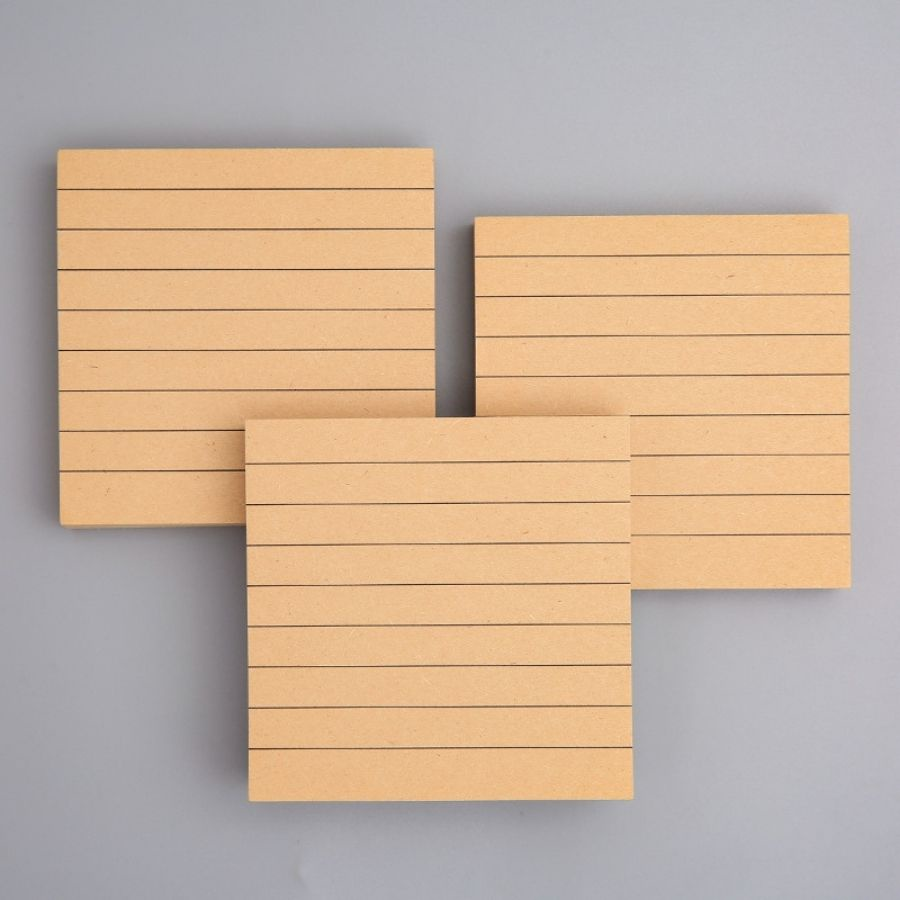

"# Learn JavaScript - Todo List

This is a simple project to learn JavaScript, building a Todo List application using localStorage for data storage.

## Description

The Todo List app allows users to:

- Add new tasks
- Mark tasks as completed
- Delete tasks
- Clear all tasks or only completed ones
- Data is automatically saved to the browser's localStorage

## How to Use

1. Open the `index.html` file in a web browser (Chrome, Firefox, etc.)
2. Enter a task in the input field and press Enter or click the "Add" button
3. Use the checkbox to mark tasks as completed
4. Click the "Delete" button to remove a specific task
5. Use "Clear Done" to remove completed tasks
6. Use "Clear All" to remove all tasks

## Project Structure

- `index.html`: Main HTML file containing the interface and CSS
- `main.js`: JavaScript file containing the app logic
- `README.md`: This documentation
- `images/`: Folder containing images (e.g., todolist.jpg)

## Technologies Used

- HTML5
- CSS3
- JavaScript (ES6+)
- localStorage API

## Learning

This project demonstrates basic JavaScript concepts:

- DOM manipulation
- Event handling
- localStorage
- Array methods (filter, map, find)
- JSON serialization

## Screenshot

"
